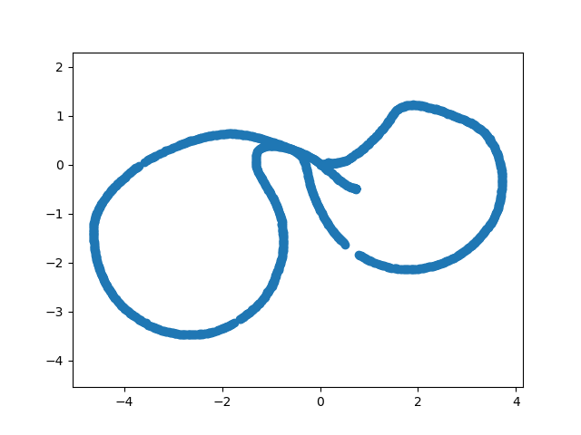
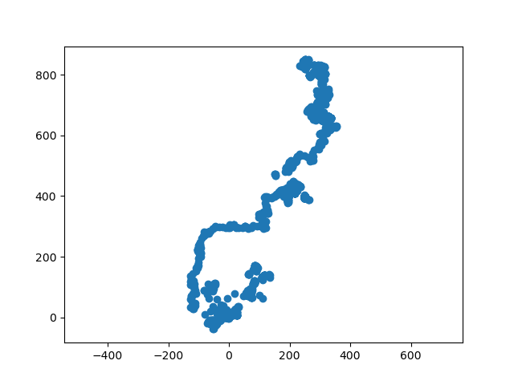

# Calibration of a tricycle robot

<!-- We are given a dataset that contains measures of the encoder ticks of the robot (both absolute for the steering angle and incremental for the traction). Besides, for each line we are given the ground truth pose of the sensor in the world frame. The idea is to model the tricycle cinematics by usign the tick readings, and by comparing with the ground truth, perform a least squares minimization to calibrate the parameters of the robot. 

These parameters are: Ksteer Ktraction axis_length steer_offset, X_0, Y_0, Theta_0, where the last three are the coords of the sensor pose with respect to the robot frame.

Initially, we had to preprocess the dataset to ensure that the data used to integrate the motion is representative enough. We have removed all data lines that do not represent a minimum traction evolution of 100 ticks. This way, we have subsampled the dataset so that every two consecutive lines undergo a change in incremental encoder of at least 100 data. As for the absolute encoder, for every two consecutive lines (after subsampling), we have taken the average value between the two of the lines (assuming not so big changes in absolute encoder). Besides, we take care of overfloaw for bot incremental and absolute, where in the dataset, absolute encoder is wrapped so to say, i.e, the maximum value is 8192, after which it wraps around and starts at 0. Similarly, for incremental readings it occurs that the variable is stored in a uint32. This means that when the maximum value is reached, the values wrap around starting at 0. This details have been managed in the review_dataset.py. Finally, in the subsampled dataset, we also have the ground truth values of the sensor pose (X,Y,Theta). We extract the relative changes between consecutive (subsampled) poses, by computing the relative isometries. This will later on act as ground truth value used to compare with in least squares optimization.

By composing the relative isometries between consecutive poses, one gets this robot trajectory:

In the file utils_bis.py we have the functions that have been used to compute the least squares minimization. -->

## Dataset and Calibration Overview

We are given a dataset that contains measures of the encoder ticks of the robot (both absolute for the steering angle and incremental for the traction). Besides, for each line we are given the ground truth pose of the sensor in the world frame. The idea is to model the tricycle kinematics by using the tick readings, and by comparing with the ground truth, perform a least squares minimization to calibrate the parameters of the robot.

These parameters are:  
`Ksteer`, `Ktraction`, `axis_length`, `steer_offset`, `X_0`, `Y_0`, `Theta_0`,  
where the last three are the coordinates of the sensor pose with respect to the robot frame.

Initially, we had to preprocess the dataset to ensure that the data used to integrate the motion is representative enough. We have removed all data lines that do not represent a minimum traction evolution of **100 ticks**. This way, we have subsampled the dataset so that every two consecutive lines undergo a change in incremental encoder of at least 100 ticks.  

As for the absolute encoder, for every two consecutive lines (after subsampling), we have taken the average value between the two lines (assuming not so big changes in absolute encoder).  

Besides, we take care of overflow for both incremental and absolute encoders:  
- The absolute encoder is wrapped, i.e., the maximum value is 8192, after which it wraps around and starts at 0.  
- For incremental readings, the variable is stored as a `uint32`. This means that when the maximum value is reached, it wraps around starting at 0.  

These details have been managed in the `review_dataset.py` script.  

Finally, in the subsampled dataset, we also have the ground truth values of the sensor pose `(X, Y, Theta)`. We extract the relative changes between consecutive (subsampled) poses by computing the relative isometries. These relative isometries later act as the ground truth values used for comparison in the least squares optimization.

By composing the relative isometries between consecutive poses, one obtains the robot trajectory:  

In the file `utils_bis.py` we have the functions that have been used to compute the least squares minimization.

This module implements a least squares calibration system for the tricycle robot kinematic parameters.

# Tricycle Robot Calibration Functions

## Overview
This module implements a least squares calibration system for tricycle robot kinematic parameters using encoder data and ground truth measurements.

## Core Functions

### Coordinate Transformation Functions

**v2t(pose)**  
- **Purpose:** Converts pose vector to homogeneous transformation matrix  
- **Input:** `[x, y, theta]` - position and orientation  
- **Output:** 3×3 transformation matrix  
- **Key Point:** Essential for 2D rigid body transformations in robotics  

**t2v(T)**  
- **Purpose:** Extracts pose vector from transformation matrix  
- **Input:** 3×3 transformation matrix  
- **Output:** `[x, y, theta]` vector  
- **Key Point:** Inverse operation of `v2t()`, uses `atan2` for the angle extraction  

**invert_isometry(T)**  
- **Purpose:** Computes inverse of an isometry
- **Math:** For rotation R and translation t:  
  `T⁻¹ = [Rᵀ, -Rᵀt; 0, 1]`   

### Motion Model Functions

**h_odom_robot(traction_tick, steer_tick, X, theta_prev)**  
- **Purpose:** Kinematic model implementing tricycle motion equations  
- **Parameters:**  
  `X = [Ksteer, Ktraction, base_line, steer_offset, X_0, Y_0, Theta_0]` - calibration parameters whose values we need to find
  Encoder readings and previous robot orientation  

- **Tricycle Model Logic:**  
  - Straight motion (small steering): Linear displacement  
  - Curved motion: Circular arc with radius `R = baseline / tan(steering_angle)`  
  - Sensor transformation: take care of sensor mounting offset relative to robot base  

- **Key Point:** This is the forward model that predicts robot motion from encoder readings. It allows us to estimate the trajectory based on the current estimate of the calibrations parameters, so as to iteratively reach the optimal values by comparing with the ground truth trajectory 

**compute_trajectory(traction_ticks, steer_ticks, X)**  
- **Purpose:** Integrates individual motions to build the trajectory  
- **Process:**  
  - Start at origin  
  - For each time step: compute motion increment and update global robot pose  
  - Track robot orientation for next iteration
  - Then, we compute the delta in sensor as (sensor_to_robot)^{-1} * delta_robot_pose * sensor_to_robot because this way we can expres the delta of the sensor pose in terms of the delta_robot_pose, which we have easily computed in the function with the cinematic model of the robot and the tick readings. 

- **Key Point:** We transform cumulative encoder data into robot path 

### Calibration Functions

**error_jacobian(trajectory, delta_Z, X, traction_ticks, steer_ticks)**  
- **Purpose:** Computes prediction errors and parameter sensitivities  
- **Error Calculation:** `error = predicted_motion - measured_motion (with box minus substraction)`  
- **Jacobian:** Numerical derivatives ∂error/∂parameter using finite differences  
- **Key Point:** Provides both the cost function and optimization gradients  

**ls_calibration(traction_ticks, steer_ticks, delta_Z, X_guess, max_iter=10)**  
- **Purpose:** Main optimization loop using Gauss-Newton method  
- **Algorithm:**  
  - Predict trajectory with current parameters  
  - Compute errors and Jacobian matrix  
  - Solve normal equations: `H·dx = -b` where `H = JᵀJ`, `b = Jᵀe`  
  - Update parameters: `X = X + dx`  
  - Repeat until convergence  

- **Key Point:** Iteratively refines parameters to minimize prediction errors  

In the main_bis.py file we include the code to actually solve the problem, by loading the preprocessed dataset, using the initial guess and calling the least squares function. We also plot the ground truth trajectory and the solution one after getting this values as a result:

[1.00030823e-01,  1.04827303e-02,  1.39065842e+00, -6.95239342e-05, -1.04696788e-01, -2.02982326e-02, -7.70417828e-02]

 By plotting the `optimal` trajectory, one sees that the result is not as expected, which shows some error in the solution that I have not been able to find. I believe this might come from a bad cinematic model or a bad preprocessing of the dataset. However, after reviewing I have not been able to figure out the source of my error.

